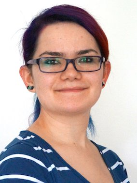

### Faculty

 

  

    
    

      
<a href="https://avandeursen.com">Arie van Deursen</a>

      
Group leader, head of Department of Software Technology

    

    

      <a href="https://twitter.com/avandeursen" title="Twitter"><i class="fab fa-twitter"></i></a>
      <a href="https://github.com/avandeursen" title="GitHub"><i class="fab fa-github"></i></a>
      <a href="https://stackoverflow.com/users/165292/avandeursen" title="StackOverflow"><i class="fab fa-stack-overflow"></i></a>
      <!--
      <a href="https://nl.linkedin.com/in/avandeursen" title="LinkedIn"><i class="fab fa-linkedin"></i></a>
    -->
      <a href="https://speakerdeck.com/avandeursen" title="Presentations"><i class="fab fa-slideshare"></i></a>
      <a href="https://scholar.google.nl/citations?user=jjCkWXgAAAAJ" title="Google Scholar"><i class="ai ai-google-scholar-square"></i></a>
      <a href="https://pure.tudelft.nl/portal/en/persons/a-van-deursen(949eb2cc-4db0-4f33-bd56-13425fa5c24a)/publications.html?pageSize=all&page=0" title="Publications"><i class="fas fa-edit"></i></a>
    

  

  

    
    

      
<a href="http://www.rinivansolingen.nl/">Rini van Solingen</a>

      
Global Software Engineering (0.2fte) 

    

    

      <a href="https://twitter.com/solingen" title="Twitter"><i class="fab fa-twitter"></i></a>
      <a href="https://nl.linkedin.com/in/solingen/" title="LinkedIn"><i class="fab fa-linkedin"></i></a>
      <a href="https://scholar.google.nl/citations?user=9LxiPOUAAAAJ" title="Google Scholar"><i class="ai ai-google-scholar-square"></i></a>
      <a href="https://pure.tudelft.nl/portal/en/persons/dm-van-solingen(2669c7b5-81a6-4f70-9d9d-e21ead041426)/publications.html?pageSize=100&page=0" title="Publications"><i class="fas fa-edit"></i></a>
    

  

  

    
    

      
<a href="http://www.spinellis.gr/">Diomidis Spinellis</a>

      
Software Analytics, Software Tools (0.2fte) 

    

    

      <a href="https://twitter.com/CoolSWEng" title="Twitter"><i class="fab fa-twitter"></i></a>
      <a href="https://github.com/DSpinellis" title="GitHub"><i class="fab fa-github"></i></a>
      <a href="https://stackoverflow.com/users/20520/diomidis-spinellis" title="StackOverflow"><i class="fab fa-stack-overflow"></i></a>
      <a href="https://www.linkedin.com/in/dspinellis/" title="LinkedIn"><i class="fab fa-linkedin"></i></a>
      <a href="https://scholar.google.com/citations?user=RjXNgA8AAAAJ" title="Google Scholar"><i class="ai ai-google-scholar-square"></i></a>
      <a href="https://research.tudelft.nl/en/persons/d-spinellis/publications/" title="Publications"><i class="fas fa-edit"></i></a>
    

  

  

    
    

      
<a href="https://azaidman.github.io">Andy Zaidman</a>

      
Software Testing, Software Evolution

    

    

      <a href="https://twitter.com/azaidman"><i class="fab fa-twitter"></i></a>
      <a href="https://github.com/azaidman"><i class="fab fa-github"></i></a>
      <a href="https://www.linkedin.com/in/andyzaidman/"><i class="fab fa-linkedin"></i></a>
      <a href="https://scholar.google.nl/citations?user=CDTfcG4AAAAJ" title="Google Scholar"><i class="ai ai-google-scholar-square"></i></a>
      <a href="https://pure.tudelft.nl/portal/en/persons/ae-zaidman(3d1ac38d-7304-44f4-bccb-087b6db66072)/publications.html" title="Publications"><i class="fas fa-edit"></i></a>
    

  

  

    
    

      
<a href="http://gousios.org">Georgios Gousios</a>

      
<a href="softanalytics.html">Software analytics</a>, software ecosystems (0.2fte)

    

    

      <a href="https://twitter.com/gousiosg" title="Twitter"><i class="fab fa-twitter"></i></a>
      <a href="https://github.com/gousiosg" title="Github"><i class="fab fa-github"></i></a>
      <a href="https://www.linkedin.com/in/gousiosg" title="LinkedIn"><i class="fab fa-linkedin"></i></a>
      <a href="http://scholar.google.gr/citations?hl=el&user=-NI5S50AAAAJ" title="Google Scholar"><i class="ai ai-google-scholar-square"></i></a>
      <a href="https://pure.tudelft.nl/portal/en/persons/g-gousios(f5ab9c4d-5210-48b6-8c39-e6e44361ac0e)/publications.html" title="Publications"><i class="fas fa-edit"></i></a>
    

  

 <!-- deck -->

  

    
    

      
<a href="https://www.mauricioaniche.com">Maurício Aniche</a>

      
Software maintenance and testing, empirical software engineering (0.2fte)

    

    

      <a href="https://twitter.com/mauricioaniche" title="Twitter"><i class="fab fa-twitter"></i></a>
      <a href="https://github.com/mauricioaniche" title="Github"><i class="fab fa-github"></i></a>
      <a href="https://www.linkedin.com/in/mauricioaniche/"><i class="fab fa-linkedin"></i></a>
      <a href="https://scholar.google.nl/citations?user=AyX0Ou0AAAAJ&hl" title="Google Scholar"><i class="ai ai-google-scholar-square"></i></a>
      <a href="hhttps://pure.tudelft.nl/portal/en/persons/m-finavaro-aniche(555c2765-502d-4254-82a6-d16ef65db961).html" title="Publications"><i class="fas fa-edit"></i></a>
    

  

  

    
    

      
<a href="https://burcuku.github.io/home">Burcu Kulahcioglu Ozkan</a>

      
Software Testing, Concurrent and Distributed Systems

    

    

      <a href="https://github.com/burcuku" title="Github"><i class="fab fa-github"></i></a>
      <a href="https://www.linkedin.com/in/burcukulahciogluozkan" title="LinkedIn"><i class="fab fa-linkedin"></i></a>
      <a href="https://scholar.google.com.tr/citations?user=HwPJzFMAAAAJ" title="Google Scholar"><i class="ai ai-google-scholar-square"></i></a>
    

  

  

    
    

      
<a href="https://apanichella.github.io">Annibale Panichella</a>

      
Computational Intelligence for SE, Automated Software Testing, Evolutionary Algorithms

    

    

      <a href="https://twitter.com/AnniPanic" title="Twitter"><i class="fab fa-twitter"></i></a>
      <a href="https://github.com/apanichella" title="Github"><i class="fab fa-github"></i></a>
      <a href="https://www.linkedin.com/in/annibale-panichella-84081186/" title="LinkedIn"><i class="fab fa-linkedin"></i></a>
      <a href="https://scholar.google.it/citations?user=xPQ72u4AAAAJ&hl=en" title="Google Scholar"><i class="ai ai-google-scholar-square"></i></a>
      <a href="https://pure.tudelft.nl/portal/en/persons/a-panichella(48ad3f35-3014-4bab-a9e9-4ba228749fdd)/publications.html?pageSize=100&page=0" title="Publications"><i class="fas fa-edit"></i></a>
    

  
    

  

    
    

      
<a href="https://proks.ch">Sebastian Proksch</a>

      
CI/CD, DevOps, Collaborative SE, Empirical SE

    

    

      <a href="https://twitter.com/prksch" title="Twitter"><i class="fab fa-twitter"></i></a>
      <a href="https://github.com/proksch" title="Github"><i class="fab fa-github"></i></a>
      <a href="https://www.linkedin.com/in/sebastian-proksch-8aba8484" title="LinkedIn"><i class="fab fa-linkedin"></i></a>
      <a href="https://scholar.google.com/citations?user=BBXa3QcAAAAJ" title="Google Scholar"><i class="ai ai-google-scholar-square"></i></a>
    

  

  

    
    

      
<a href="https://luiscruz.github.io/">Luís Cruz</a>

      
Green SE, AI Engineering

    

    

      <a href="https://twitter.com/luismcruz"><i class="fab fa-twitter"></i></a>
      <a href="http://github.com/luiscruz"><i class="fab fa-github"></i></a>
      <a href="https://www.linkedin.com/in/luismirandacruz"><i class="fab fa-linkedin"></i></a>
      <a href="https://scholar.google.com/citations?user=O13oaH0AAAAJ&hl=en" title="Google Scholar"><i class="ai ai-google-scholar-square"></i></a>
   

  

  

    
    

      
<a href="https://durieux.me">Thomas Durieux</a>

      
Software maintenance, Software evolution, Software debloat, Empirical SE

    

    

      <a href="https://twitter.com/thodurieux"><i class="fab fa-twitter"></i></a>
      <a href="http://github.com/tdurieux"><i class="fab fa-github"></i></a>
      <a href="https://scholar.google.com/citations?user=CoUKVbUAAAAJ&hl=en" title="Google Scholar"><i class="ai ai-google-scholar-square"></i></a>
   

  

### Postdocs

    
    

      
<a href="https://pouria-d.me">Pouria Derakhshanfar</a>

      
Search-based software testing, DevOps, DevOps for Cyber-Physical Systems

    

    

      <a href="https://twitter.com/PDerakhshanfar"><i class="fab fa-twitter"></i></a>
      <a href="https://github.com/pderakhshanfar"><i class="fab fa-github"></i></a>
      <a href="https://www.linkedin.com/in/pouria-derakhshanfar-086b0066/"><i class="fab fa-linkedin"></i></a>
      <a href="https://scholar.google.com/citations?user=CEMIPmsAAAAJ&hl=en" title="Publications"><i class="fas fa-edit"></i></a>
    

  

  

    
    

      
<a href="http://ce.sharif.edu/~malizadi/index.html">Maliheh Izadi</a>

      
Software analytics

    

    

      <a href="https://twitter.com/malihehizadi"><i class="fab fa-twitter"></i></a>
      <a href="https://github.com/MalihehIzadi"><i class="fab fa-github"></i></a>
      <a href="https://linkedin.com/in/malihe-izadi"><i class="fab fa-linkedin"></i></a>
      <a href="https://scholar.google.com/citations?user=F2D5RawAAAAJ&hl=en" title="Publications"><i class="fas fa-edit"></i></a>
    

  

  

### PhD Students

<!-- Registered in TU Delft EEMCS Graduate School -->

  

    
    
      
    
<a href="https://twonki.github.io/">Leonhard Applis</a>

      
ML for (Security) Testing, Anger Management

    

    

      <a href="https://twitter.com/lapplislazuli"><i class="fab fa-twitter"></i></a>
      <a href="https://github.com/twonki"><i class="fab fa-github"></i></a>
    

  

  
  

    
    

      
<a href="https://carolin-brandt.de/">Carolin Brandt</a>

      
<a href="https://testshiftproject.github.io/visualizing-amplification">Test visualization and amplification</a>

    

    

      <a href="https://github.com/lacinoire"><i class="fab fa-github"></i></a>
      <a href="https://www.linkedin.com/in/carolin-brandt"><i class="fab fa-linkedin"></i></a>
    

  

 
  

    
    

      
<a href="https://adeljouyi.com">Amirhossein Deljouyi</a>

      
Test Visualization, Test Decomposition, Test Automation

    

    

      <a href="https://twitter.com/deljouyi"><i class="fab fa-twitter"></i></a>
      <a href="https://github.com/amirdeljouyi"><i class="fab fa-github"></i></a>
      <a href="https://www.linkedin.com/in/amirhossein-deljouyi-3b929661/"><i class="fab fa-linkedin"></i></a>
      <a href="https://scholar.google.com/citations?user=jEHXg2QAAAAJ&hl=en" title="Google Scholar"><i class="ai ai-google-scholar-square"></i></a>
      <a href="https://research.tudelft.nl/en/persons/a-deljouyi" title="Publications" target="_blank"><i class="fas fa-edit"></i></a>
    

  

  

    
    

      
<a href="">Imara van Dinten</a>

      
DevOps for cyberphysical systems

    

    

      <a href="https://twitter.com/IvDinten"><i class="fab fa-twitter"></i></a>
      <a href="https://github.com/IvDinten"><i class="fab fa-github"></i></a>
      <a href="https://www.linkedin.com/in/imara-van-dinten/"><i class="fab fa-linkedin"></i></a>
    

  

  

    
    

      

        <a href="https://mardibiase.github.io" target="_blank">Marco di Biase</a>
      

      
Maintainability. Also at SIG

    

    

      <a href="https://twitter.com/mardibiase" target="_blank"><i class="fab fa-twitter"></i></a>
      <a href="https://github.com/mardibiase" target="_blank"><i class="fab fa-github"></i></a>
      <a href="https://www.linkedin.com/in/mardibiase/" target="_blank"><i class="fab fa-linkedin"></i></a>
      <a href="https://pure.tudelft.nl/portal/en/persons/m-di-biase(175bd28e-fb78-485c-816e-fcd1369d5f3d)/publications.html" title="Publications" target="_blank"><i class="fas fa-edit"></i></a>
    

  

  

    
    

      
<a href="https://jhejderup.github.io">Joseph Hejderup</a>

      
Software ecosystems

    

    

      <a href="https://twitter.com/jhejderup"><i class="fab fa-twitter"></i></a>
      <a href="https://github.com/jhejderup"><i class="fab fa-github"></i></a>
      <a href="https://www.linkedin.com/in/josephhejderup"><i class="fab fa-linkedin"></i></a>
      <a href="https://pure.tudelft.nl/portal/en/persons/ji-hejderup(65f98b5d-e9d8-47a0-b720-9a1270f816e0)/publications.html" title="Publications"><i class="fas fa-edit"></i></a>
    

  

 

    
    

      
Bas Jansen

      
Spreadsheet programming

    

    

      <a href="https://twitter.com/heerbommel"><i class="fab fa-twitter"></i></a>
      <a href="https://scholar.google.nl/citations?user=egl5tVQAAAAJ&hl=en" title="Google Scholar"><i class="ai ai-google-scholar-square"></i></a>
      <a href="https://pure.tudelft.nl/portal/en/persons/b-jansen(bfa125a2-c776-4191-bf18-e776dd145ff1)/publications.html" title="Publications"><i class="fas fa-edit"></i></a>
    

  
  

  

    
    

      

        <a href="https://ashkboos.github.io/MyWebsite/">Mehdi Keshani</a>
      

      
Software analytics, Software Evolution

    

    

      <a href="https://twitter.com/mehkeshani" title="Twitter"><i class="fab fa-twitter"></i></a>
      <a href="https://github.com/ashkboos" title="GitHub"><i class="fab fa-github"></i></a>
      <a href="https://www.linkedin.com/in/mehdi-keshani-73b751158/" title="LinkedIn"><i class="fab fa-linkedin"></i></a>
      <a href="https://scholar.google.nl/citations?user=EwgnxxoAAAAJ&hl=en" title="Google Scholar"><i class="ai ai-google-scholar-square"></i></a>
    

  

  

    
    

      

        <a href="https://github.com/ekula">Elvan Kula</a>
      

      
Software analytics, AI. Also at ING

    

    

      <a href="https://twitter.com/kulaelvan" title="Twitter"><i class="fab fa-twitter"></i></a>
      <a href="https://github.com/ekula" title="GitHub"><i class="fab fa-github"></i></a>
      <a href="https://www.linkedin.com/in/elvan-kula/" title="LinkedIn"><i class="fab fa-linkedin"></i></a>
      <a href="https://scholar.google.nl/citations?hl=en&user=M5sWo0oAAAAJ" title="Google Scholar"><i class="ai ai-google-scholar-square"></i></a>
    

  

  

	  
    

		

			<a href="https://akhatami.com">Ali Khatami</a>
		

		
Software Quality Analytics

    

    

		 <a href="https://twitter.com/_akhatami_" title="Twitter"><i class="fab fa-twitter"></i></a>
      <a href="https://github.com/akhatami" title="GitHub"><i class="fab fa-github"></i></a>
      <a href="https://www.linkedin.com/in/alikhatami/" title="LinkedIn"><i class="fab fa-linkedin"></i></a>
      <i class="ai ai-google-scholar-square"></i>
    

  

  
  

	  
    

		

			<a href="https://chandramaddila.github.io/">Chandra Maddila</a>
		

		
AI assisted DevOps, Software Analytics. Also at Microsoft Research

    

    

		<a href="https://www.linkedin.com/in/cmaddila/" title="LinkedIn"><i class="fab fa-linkedin"></i></a>
    

  

  

    
    

      

        <a href="https://mirblog.net/" title="Amir's personal blog">Amir M. Mir</a>
      

      
Machine Learning, Software Analytics

    

    

      <a href="https://github.com/mir-am" title="GitHub"><i class="fab fa-github"></i></a>
      <a href="https://www.linkedin.com/in/mir93/" title="LinkedIn"><i class="fab fa-linkedin"></i></a>
      <a href="https://scholar.google.com/citations?user=IZB4GI8AAAAJ&hl=en" title="Google Scholar"><i class="ai ai-google-scholar-square"></i></a>
	  <a href="https://pure.tudelft.nl/portal/en/persons/sam-mir(6b4ddcf8-e30c-4da1-b667-a1f47d755217).html" title="Publications"><i class="fas fa-edit"></i></a>
    

  

  

    
    

      

        <a href="https://mitchellolsthoorn.com" target="_blank">Mitchell Olsthoorn</a>
      

      
Computational Intelligence for SE, Security Testing, Blockchain

    

    

      <a href="https://twitter.com/mitchellolstho" target="_blank"><i class="fab fa-twitter"></i></a>
      <a href="https://github.com/mitchellolsthoorn" target="_blank"><i class="fab fa-github"></i></a>
      <a href="https://www.linkedin.com/in/mitchellolsthoorn/" target="_blank"><i class="fab fa-linkedin"></i></a>
      <a href="https://pure.tudelft.nl/portal/en/persons/mjg-olsthoorn(7e06b8fd-4be5-45f8-8a97-bd9c8ac80fd5).html" title="Publications" target="_blank"><i class="fas fa-edit"></i></a>
    

  

  

    
    

      
Sohon Roy

      
Spreadsheet programming, testing

    

    

      <a href="https://twitter.com/sohonroy"><i class="fab fa-twitter"></i></a>
      <a href="https://github.com/sohonroy"><i class="fab fa-github"></i></a>
      <a href="https://scholar.google.nl/citations?user=VuDRJ2kAAAAJ&hl=en" title="Google Scholar"><i class="ai ai-google-scholar-square"></i></a>
      <a href="https://pure.tudelft.nl/portal/en/persons/s-roy(3877362c-2ace-451c-9679-24c6e5b6ecf7)/publications.html" title="Publications"><i class="fas fa-edit"></i></a>
    

  

  

    
    

      

        <a href="https://arumoy.me">Arumoy Shome</a>
      

      
SE for AI

    

    

      <a href="https://github.com/arumoy-shome"><i class="fab fa-github"></i></a>
      <a href="https://www.linkedin.com/in/arumoyshome/"><i class="fab fa-linkedin"></i></a>
    

  

  

    
    

      
Mark Swillus

      
Socio-technical enablers/inhibitors of software testing

    

    

      <a href="https://github.com/mswillus"><i class="fab fa-github"></i></a>
      <a href="https://scholar.social/web/accounts/215562"><i class="fab fa-mastodon"></i></a>
    

  

  

    
    

      

        <a href="https://github.com/Natsukashiii">Shujun Huang</a>
      

      
 Software engineering, DevOps, CI/CD

    

    

      <a href="https://twitter.com/SJun36289288" title="Twitter"><i class="fab fa-twitter"></i></a>
      <a href="https://github.com/Natsukashiii" title="GitHub"><i class="fab fa-github"></i></a>
    

  

### Scientific Programmers

  

    
    

      
Dimitri Stallenberg

      
Computational Intelligence for SE

    

    

      <a href="https://github.com/dstallenberg"><i class="fab fa-github"></i></a>
      <a href="https://www.linkedin.com/in/dimitri-stallenberg-22ab3a159/"><i class="fab fa-linkedin"></i></a>
    

  

<!-- ### Guests -->

### Support

  

    
    

      
Kim Boudewijn

      
Secretary

    

    

      <a href="https://nl.linkedin.com/in/kim-boudewijn-095189230" title="LinkedIn"><i class="fab fa-linkedin"></i></a>
      <a href="mailto:K.Boudewijn@tudelft.nl" title="Email"><i class="far fa-envelope"></i></a>
    

  

  

    
    

      
Shemara van der Zwet

      
Secretary

    

    

      <a href="https://www.linkedin.com/in/shemara-van-der-zwet-1a5b70122" title="LinkedIn"><i class="fab fa-linkedin"></i></a>
      <a href="mailto:s.j.vanderzwet@tudelft.nl" title="Email"><i class="far fa-envelope"></i></a>
    

  

### Alumni

<!-- Dear alumnus: Please feel free to offer your change of affiliation in a pull request! -->

Name | Period | Role | Current Affiliation
--|--|--|--
[Vivek Arora](https://www.linkedin.com/in/vivekar/) | 2019-2022| PhD | Microsoft, India
[Jeanderson Cândido](https://www.linkedin.com/in/jeandersonbc/) | 2018-2022 | PhD | PicNic, NL
[Marielli Wessel](https://www.linkedin.com/in/mairieli/) | 2021-2022 | Postdoc | Assistant professor, Radboud Universiteit Nijmegen
[Wouter Zorgdrager](https://www.linkedin.com/in/wouter-zorgdrager-a4746512a) | 2018-2021 | Research Engineer | Delivery Hero, Germany
[Xavier Devroey](http://xdevroey.be) | 2017-2021 | Post-doc | University of Namur, Belgium
[Hennie Huijgens](https://www.linkedin.com/in/henniehuijgens/) | 2013-2018 | PhD candidate | HU Uni. of Appl. Sciences, Utrecht, NL
[Ayushi Rastogi](https://ayushirastogi.github.io) | 2018-2021 | Post-doc | Assistant professor, University of Groningen, Netherlands 
[Vladimir Kovalenko](https://www.linkedin.com/in/vladimir-kovalenko-01416b88/) | 2016-2021 | PhD student | JetBrains 
[Davide Spadini](https://www.linkedin.com/in/davidespadini/) | 2016-2021 | PhD student | Facebook |
[Enrique Larios Vargas](https://www.linkedin.com/in/enrique-larios-vargas/) | 2017-2020 | Post-doc | University of Victoria, Canada
[Maliheh Izadi](http://ce.sharif.edu/~malizadi/index.html)             | 2020-2020 | Visitor  | Sharif University, Iran|
[Xunhui Zhang](https://zhangxunhui.github.io)                          | 2019-2020 | Visitor  | NUDT, China|
[Gemma Catolino](https://www.gemmacatolino.com)                        | 2019-2020 | Post-doc | University of Tilburg / JADS |
[Luca Pascarella](http://lucapascarella.com/)                          | 2016-2020 | PhD student | USI, CH 
[Qianqian Zhu](https://nl.linkedin.com/in/qianqian-zhu-801077a4)       | 2015-2020 | PhD student | University of Edinburgh |
[Boris Cherry](https://www.linkedin.com/in/boris-c-250884b7/)          | 2020-2020 | Visitor | [University of Namur](https://www.unamur.be/en) |
[Anand Sawant](https://www.linkedin.com/in/anand-sawant-03351a29/)     | 2009-2019 | PhD student | UC Davis, USA |
[Alaaeddin Swidan](https://nl.linkedin.com/in/aas-swidan)              | 2015-2019 | PhD student | Open Universiteit |
[Efthimia Aivaloglou](https://aivaloglou.org/)                         | 2013-2019 | Developer, guest researcher | [LIACS](http://perl.liacs.nl) |
[Moritz Beller](https://inventitech.com/)                              | 2013-2019 | PhD student, postdoc | Facebook |
[Maria Kechagia](https://mkechagia.github.io)                          | 2017-2019 | Postdoc | UCL, UK
[Mozhan Soltani](https://www.linkedin.com/in/mozhan-soltani-307990174/) | 2016-2019 | PhD student | [LIACS](http://perl.liacs.nl) |
[Chushu Gao](https://www.linkedin.com/in/chushu-gao-b14b42b/)          | 2018-2018 | Visitor | [SIG](https://www.softwareimprovementgroup.com/), NL
[Gema Rodriguez-Perez](https://gemarodri.github.io/Presentacion/)      | 2017-2018 | Postdoc | U. Waterloo, CA
[Marlies Aldewereld](https://dblp.uni-trier.de/pers/hd/a/Aldewereld:Marlies) | 2018-2018 | PhD Student | [LIACS](http://perl.liacs.nl) & [Windesheim](https://www.windesheim.nl/onderzoek/onderzoeksthemas/educatie/leiderschap-in-onderwijs-en-opvoeding/team)
[Marileen Smit](https://dblp.uni-trier.de/pers/hd/s/Smit:Marileen)     | 2017-2018 | Teaching Support | [LIACS](http://perl.liacs.nl) & [FutureNL](https://futurenl.org/)
[Robert Holwerda](https://dblp.uni-trier.de/pers/hd/h/Holwerda:Robert) | 2016-2018 | PhD student | [LIACS](httpL//perl.liacs.nl) & [HAN](https://www.han.nl/)
[Felienne Hermans](https://www.universiteitleiden.nl/en/staffmembers/felienne-hermans#tab-1) | 2009-2018 | PhD stud., assist. prof. | [LIACS](http://perl.liacs.nl)
[Fabio Palomba](https://fpalomba.github.io) | 2017-2017 | Postdoc | Univesrity of Salarno, Italy
[Alberto Bacchelli](https://sback.it/)                                 | 2013-2017 | Associate professor | [U. Zurich](https://www.uzh.ch/en.html), CH
[Nicolas Dintzner](https://dblp.org/pers/hd/d/Dintzner:Nicolas)        | 2013-2017 | PhD student | TU Delft / TPM
[Tamara Brusik](https://nl.linkedin.com/in/tamara-brusik-202a037b)     | 2014-2017 | Secretary | TU Delft / HR
[Petra Heck](https://dblp.org/pers/hd/h/Heck:Petra)                    | 2012-2016 | PhD student | [Fontys](https://fontys.nl/), NL
[Eelco Visser](https://eelcovisser.org/)                               | 2006-2015 | Professor | TU Delft / [PL](https://www.tudelft.nl/en/eemcs/the-faculty/departments/software-technology/programming-languages/)
[Danny Groenewegen](https://dblp.org/pers/hd/g/Groenewegen:Danny_M=)   | 2009-2015 | PhD student | TU Delft / [PL](https://www.tudelft.nl/en/eemcs/the-faculty/departments/software-technology/programming-languages/)
[Guido Wachsmuth](https://dblp.org/pers/hd/w/Wachsmuth:Guido)          | 2009-2015 | Assistant professor | [Oracle Labs](https://labs.oracle.com/), CH
[Marco Vit](https://www.linkedin.com/in/marco-vit-145b71106/)          | 2015-2015 | Scientific programmer | DiTech, IT
[Steven Raemaekers](https://dblp.org/pers/hd/r/Raemaekers:Steven)      | 2011-2015 | PhD student | [ATS Distributed](https://www.atsdistributed.com/), NL
[Cuiting Chen](https://dblp.org/pers/hd/c/Chen:Cuiting)                | 2011-2015 | PhD student | [SIG](https://www.softwareimprovementgroup.com/), NL
[Anja Guzzi](https://dblp.org/pers/hd/g/Guzzi:Anja)                    | 2010-2015 | PhD Student |   |
[Tiago Espinha](https://dblp.org/pers/hd/e/Espinha:Tiago)              | 2010-2015 | PhD student | [Ocado](https://www.ocadotechnology.com/), UK
[Daniele Romano](https://dblp.org/pers/hd/r/Romano:Daniele)            | 2010-2015 | PhD student | [ING](https://www.ing.com/Home.htm), NL
[Esther van Seters](https://www.linkedin.com/in/eevanseters/)        | 2009-2014 | Secretary | [NFI](https://www.forensischinstituut.nl/), NL
[Markus Völter](http://voelter.de/)                                    | 2013-2014 | PhD student | Independent, DE
[Ben van Gameren](https://dblp.org/pers/hd/g/Gameren:Ben_van)          | 2010-2014 | PhD student | [iHomer](https://ihomer.nl/), NL
[Kevin Dullemond](https://dblp.org/pers/hd/d/Dullemond:Kevin)          | 2010-2014 | PhD student | [Mendix](https://www.mendix.com/), NL
[Hans Geers](https://www.linkedin.com/in/hans-geers-3533b062/)         | 1986-2014 | Senior lecturer    | Retired
[Cor-Paul Bezemer](https://www.ece.ualberta.ca/~bezemer/)              | 2009-2013 | PhD student | U. Alberta, CA
[Maartje de Jonge](https://dblp.uni-trier.de/pers/hd/j/Jonge:Maartje_de)| 2009-2013 | PhD student | Independent, NL
[Eric Bouwers](https://dblp.uni-trier.de/pers/hd/b/Bouwers:Eric)       | 2009-2013 | PhD student | [Grasple](https://www.grasple.com/), NL
[Michaela Greiler](https://dblp.org/pers/hd/g/Greiler:Michaela)        | 2008-2013 | PhD student | Independent, Austria
[Martin Pinzger](https://www.aau.at/en/isys/serg/team/pinzger-martin/) | 2008-2013 | Assistant professor | [U. Klagenfurt](https://www.aau.at/en/), Austria
[Kees Pronk](https://dblp.uni-trier.de/pers/hd/p/Pronk:Cornelis)       | 1981-2013 | Assistant professor | Retired
[Sander van der Burg](http://sandervanderburg.nl/)                     | 2008-2012 | PhD student | [Mendix](https://www.mendix.com/), NL
[Hans-Gerhard Gross](https://dblp.org/pers/hd/g/Gro=szlig=:Hans=Gerhard) | 2005-2012 | Assistant professor | [Hochschule Esslingen](https://www.hs-esslingen.de/), DE
[Sander Vermolen](https://dblp.uni-trier.de/pers/hd/v/Vermolen:Sander) | 2008-2012 | PhD student | [ASML](https://www.asml.com), NL
[Eelco Dolstra](https://dblp.org/pers/hd/d/Dolstra:Eelco)              | 2008-2012 | Postdoc | [Tweag I/O](https://www.tweag.io/), NL
[Éric Piel](https://dblp.dagstuhl.de/pers/hd/p/Piel:=Eacute=ric)       | 2008-2012 | Postdoc | [DELMIC](http://www.delmic.com/), NL
[Alberto González-Sanchez](https://dblp.dagstuhl.de/pers/hd/g/Gonz=aacute=lez=Sanchez:Alberto) | 2007-2011 | PhD student | Google, UK
[Rob Vermaas](https://dblp.org/pers/hd/v/Vermaas:Rob)                  | 2009-2011 | Scientific Programmer | [RelationalAI](http://relational.ai/), NL
[Zef Hemel](https://zef.me/)                                           | 2008-2011 | PhD student | [OLX GROUP](https://www.olxgroup.com/), PL
[Lennart Kats](https://dblp.org/pers/hd/k/Kats:Lennart_C=_L=)          | 2008-2011 | PhD student | Amazon, [AWS Cloud9](https://aws.amazon.com/cloud9/), NL
[Peter Kluit](https://www.linkedin.com/in/peterkluit/)                 | 1986-2010 | Senior lecturer    | Retired
[Ali Mesbah](https://dblp.uni-trier.de/pers/hd/m/Mesbah_0001:Ali)      | 2005-2010 | PhD student, postdoc | UBC, CA
[Cathal Boogerd](https://dblp.org/pers/hd/b/Boogerd:Cathal)            | 2005-2009 | PhD student | [SIG](https://www.softwareimprovementgroup.com/), NL
[Bas Cornelissen](https://dblp.org/pers/hd/c/Cornelissen:Bas)          | 2005-2009 | PhD student | [SIG](https://www.softwareimprovementgroup.com/), NL
[Peter Zoeteweij](https://dblp.uni-trier.de/pers/hd/z/Zoeteweij:Peter) | 2005-2009 | Postdoc     | [IntelliMagic](https://www.intellimagic.com/), NL
[Rui Maranhao Abreu](https://dblp.uni-trier.de/pers/hd/a/Abreu:Rui)    | 2005-2009 | PhD student | U. Lisbon, PO
[Arjan van Gemund](https://dblp.uni-trier.de/pers/hd/g/Gemund:Arjan_J=_C=_van) | 2005-2009 | Professor | Retired
[Alexander Feldman](https://dblp.org/pid/44/4566.html) | 2005-2009 | PhD student | PARC, USA
[Marco Lormans](https://dblp.org/pers/hd/l/Lormans:Marco)              | 2002-2008 | PhD student | Xebia, NL
[Leon Moonen](https://leonmoonen.com/)                                 | 2003-2008 | Assistant professor | Simula, NO
[Magiel Bruntink](https://dblp.uni-trier.de/pers/hd/b/Bruntink:Magiel) | 2003-2008 | PhD student | [SIG](https://www.softwareimprovementgroup.com/), NL
[Marius Marin](https://dblp.uni-trier.de/pers/hd/m/Marin:Marius)       | 2003-2007 | PhD student | Microsoft, USA
[Bas Graaf](https://dblp.org/pers/hd/g/Graaf:Bas)                      | 2002-2007 | PhD student | [SimCorp](https://www.simcorp.com/), DK
[Frans Ververs](https://www.linkedin.com/in/fransververs/)             | 1969-2006 | Associate professor | Retired
[Jan van Katwijk](https://www.linkedin.com/in/jan-katwijk-van-07946a/) | 1984-2002 | Professor, dean | Retired
[Willem van der Poel](https://en.wikipedia.org/wiki/Willem_van_der_Poel) | 1962-1990 | Professor | Retired

